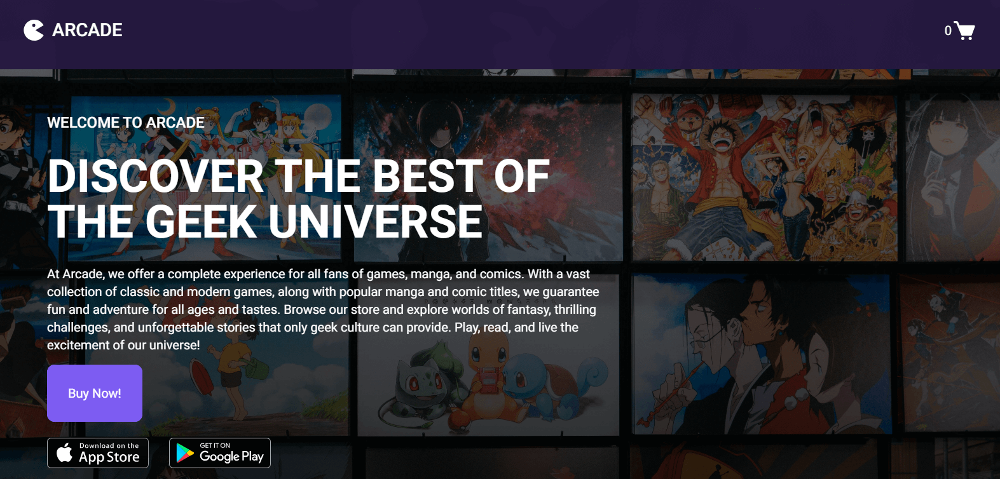
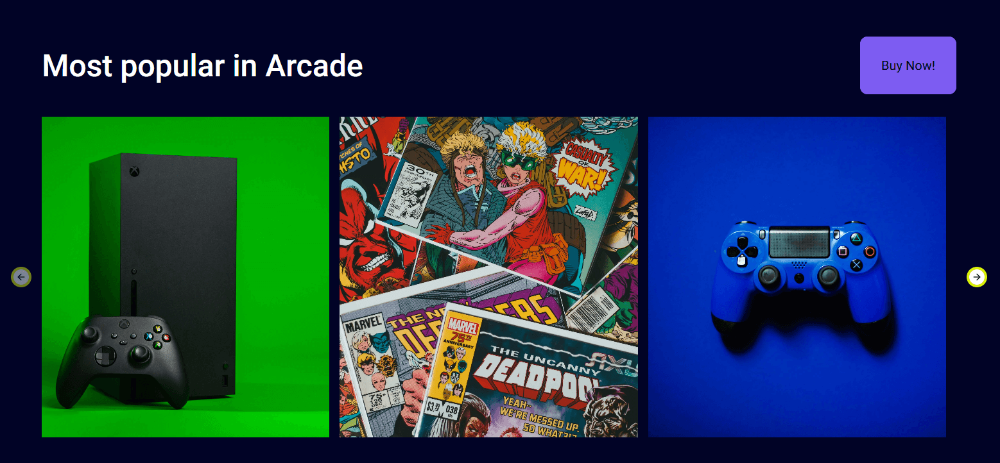

# Description
This project is a responsive online store page for geek products, built with Next.js. It features a modern design with interactive sliders to showcase highlighted items and hover animations that provide subtle effects on product cards. Smooth transitions between elements create a seamless browsing experience, while a fully responsive layout ensures consistent visuals across all devices. The result is an engaging, user-friendly interface that aligns with the store’s geek-themed brand.

# Main Features
- Next.js
- Interactive sliders
- Hover animations
- Responsive design

# Screenshots

